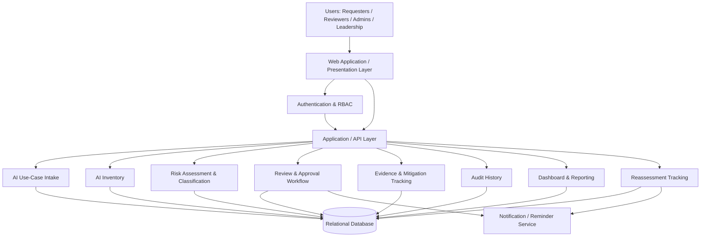

# System Architecture Diagram

## Architecture Rationale

The MVP uses a layered, modular web architecture. The presentation layer serves multiple user roles while authentication and role-based authorization protect governance functions. Business modules are separated logically so intake, inventory, risk classification, review, evidence, auditing, reporting, and reassessment can evolve independently while sharing a relational data layer. For the capstone, these logical modules may be deployed as a modular monolith to reduce operational overhead while maintaining clear module boundaries.
